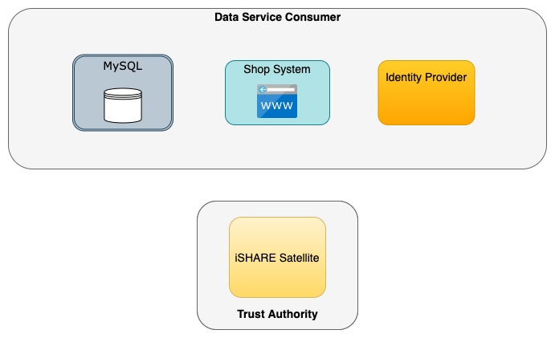

# Data Service Consumer

This describes how to setup the environment of a data service consuming organisation within the i4Trust trusted data space with the 
example of fictitious 
* Packet Delivery Company being the service provider
* Happy Pets Inc. being the consuming organisation

The whole environment will consist of the following components:
* Keyrock (Identity Provider)
* MySQL

as depicted in the following diagram:



Note that there is not an example of a Shop System provided. In the use case example, it is assumed that there are already 
users registered at Happy Pets and which have placed orders. More precisely, this means that there are already 
existing delivery order entities within the Context Broker of 
the [Data Service Provider](../Data-Service-Provider).

Furthermore it is required that there is access to an iSHARE Satellite instance and an iSHARE-compliant Authorisation 
Registry which stores the user's access policies. It is assumed that the consuming organisation is already registered at the 
iSHARE Satellite and that 
certificates, a private key and the EORI have been issued. Starting with Keyrock Release 8.0.0, Keyrock provides it's own 
iSHARE-compliant Authorisation Registry and can be used instead.

In the following it is assumed that the components will be externally available via the domain `domain.org` and that the 
issued EORI is `EU.EORI.NLHAPPYPETS`. 

This description provides examples of the [Helm values files](./values) which show the minimum configuration 
parameters to be set. Adapt these for your setup before proceeding with the instructions.

The helm chart of Keyrock with all possible configuration values can be found here:
* [Keyrock](https://github.com/FIWARE/helm-charts/tree/main/charts/keyrock)

It is assumed that all components will be deployed within the namespace `consumer`. Change this name according to your 
needs.
```shell
kubectl create ns consumer
```

Due to the iSHARE specification, requests can contain very large headers with the signed JWTs. 
When using Kubernetes, note that the ingress controller must be capable of handling large request headers. When using 
nginx as ingress controller, these are the proposed parameters to be set:
```yaml
large-client-header-buffers: "8 32k"
http2-max-field-size: "32k"
http2-max-header-size: "32k"
```

## MySQL Database

For the MySQL database there is no changed configuration compared to the instructions of the repository 
[production-on-k8s](https://github.com/FIWARE/production-on-k8s/tree/main/NGSI-LD_Data-Provider). Just follow the steps 
described about MySQL in the linked repository.


## Keyrock

The Keyrock Identity Provider is required for storing the accounts of the users accessing the Packet Delivery Company 
data service. In the experimentation framework example, it is needed in order that shop users can login at the Packet Delivery 
Company portal and access their delivery orders.

Modify the Keyrock [values file](./values/values-keyrock.yml) according to your needs and deploy the Keyrock Identity Provider. 
When there is no external authorisation registry configured for Keyrock, it will use it's internal authorisation registry and 
policies need to be stored there.
Make sure to setup an Ingress or OpenShift route in the values file for external 
access of the UI (e.g. https://keyrock.domain.org). Also note that for the moment a dedicated Keyrock build needs to be used until 
the i4Trust related changes have been officially released: `fiware/idm:i4trust-rc4`. The issued private key and certificate 
chain must be added in PEM format. 
```shell
helm repo add fiware https://fiware.github.io/helm-charts/
helm repo update
helm install -f ./values/values-keyrock.yml --namespace consumer keyrock fiware/keyrock --version 0.4.1
```

In a browser open the Keyrock UI (e.g. https://keyrock.domain.org) and login with the admin credentials provided in 
the values file. Then users can be created by the Admin user, or users sign up on their own.

When using the internal authorisation registry of Keyrock, one might need to increase the maximum header size of the 
internal web server by setting the ENV, e.g. to
```shell
IDM_SERVER_MAX_HEADER_SIZE=32786
```
See the [values file](./values/values-keyrock.yml) for an example.


## User policies

It is assumed that the consuming organisation was already granted access to the service of the data provider. 
Also check the instructions about the [Data Service Provider](../Data-Service-Provider). 

In order that users of the consuming organisation can access this service, the consuming organisation needs to delegate 
it's access rights to them, which means to create user policies at the authorisation registry belonging 
to the consuming organisation. 

As an example, the consuming organisation is the company Happy Pets Inc. with the 
EORI `EU.EORI.NLHAPPYPETS`, which acquired read and write access to the data service 
of the Packet Delivery Company, as described in the instructions of the 
[Data Service Provider](../Data-Service-Provider). At Happy Pets, there is a customer user registered at the 
organisation's Keyrock instance with ID `aaaa-bbbb-cccc-dddd`, which should be granted the same access rights as for the organisation, 
**but** only for a **specific entity** with ID `urn:ngsi-ld:DELIVERYORDER:HAPPYPETS001`. The policy to be created at the 
consuming organisation's authorisation registry then would look like the following:
```json
{
	"delegationEvidence": {
		"notBefore": 1616583866,
		"notOnOrAfter": 1648080000,
		"policyIssuer": "EU.EORI.NLHAPPYPETS",
		"target": {
			"accessSubject": "aaaa-bbbb-cccc-dddd"
		},
		"policySets": [
			{
				"target": {
					"environment": {
						"licenses": [
							"ISHARE.0001"
						]
					}
				},
				"policies": [
					{
						"target": {
							"resource": {
								"type": "DELIVERYORDER",
								"identifiers": [
									"urn:ngsi-ld:DELIVERYORDER:HAPPYPETS001"
								],
								"attributes": [
									"pta",
									"pda"
								]
							},
							"actions": [
								"PATCH"
							]
						},
						"rules": [
							{
								"effect": "Permit"
							}
						]
					},
					{
						"target": {
							"resource": {
								"type": "DELIVERYORDER",
								"identifiers": [
									"urn:ngsi-ld:DELIVERYORDER:HAPPYPETS001"
								],
								"attributes": [
									"*"
								]
							},
							"actions": [
								"GET"
							]
						},
						"rules": [
							{
								"effect": "Permit"
							}
						]
					}
				]
			}
		]
	}
}
```
